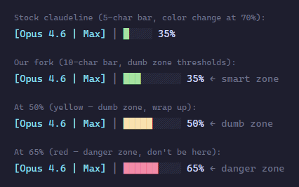

# claudeline (smshd fork)

A fork of [fredrikaverpil/claudeline](https://github.com/fredrikaverpil/claudeline) — a minimalistic Claude Code status line written in Go.

This fork tweaks the context window progress bar to better suit how we work with long Claude Code sessions.

## What we changed (and why)

### Wider context bar (10 chars instead of 5)

The context window is the single most important thing to keep an eye on during a session. A wider bar makes it easier to gauge at a glance — especially when you're deep in a task and only catching the status line in your peripheral vision.



### Earlier color thresholds (the "Dumb Zone")

Stock claudeline stays green until 70%, then yellow, then red near compaction. By 70% you're already deep in what we call the **Dumb Zone** — and it's too late to course-correct.

The concept comes from [this video by Dex](https://www.youtube.com/watch?v=rmvDxxNubIg&t=493s): your context window has roughly 168,000 tokens, and around the 40% mark you start getting diminishing returns. The more of the window you've used up, the worse the model performs. If your context is packed with MCP JSON dumps, file searches, test output, and UUIDs, you're doing all your actual work in the zone where the model is least capable.

The fix is **intentional compaction** — regularly compressing your context before you hit that zone. You condense your working state into a markdown summary (specific files, line numbers, decisions made, the problem being solved), then start a fresh context window. The new session picks up from the summary and works in the "smart zone" instead of wading through stale noise.

Our thresholds are designed around this workflow:

| Range | Color | Zone | Meaning |
|-------|-------|------|---------|
| 0–40% | Green | Smart zone | Full performance, work freely |
| 41–60% | Yellow | Dumb zone | Wrap up your current task or compact |
| 61%+ | Red | Danger zone | You really don't want to get here — compact now or start fresh |

The compaction warning (`⚠`) from upstream still triggers at 80% as a final alert.

### Everything else is stock

All other features — subscription plan label, 5-hour/7-day quota bars, git branch display, credential handling, caching — are unchanged from upstream.

## Installation

1. Clone and build:

```bash
git clone https://github.com/smshd/claudeline.git
cd claudeline
go build -o ~/.local/bin/claudeline .
```

2. Add to `~/.claude/settings.json`:

```json
{
  "statusLine": {
    "type": "command",
    "command": "~/.local/bin/claudeline -git-branch"
  }
}
```

3. Restart Claude Code.

## Flags

| Flag | Default | Description |
|------|---------|-------------|
| `-debug` | `false` | Write warnings/errors to `/tmp/claudeline-debug.log` |
| `-git-branch` | `false` | Show git branch in the status line |
| `-git-branch-max-len` | `30` | Max display length for git branch |
| `-version` | `false` | Print version and exit |

## Keeping up with upstream

```bash
git fetch upstream
git merge upstream/main
go build -o ~/.local/bin/claudeline .
```

## Credits

Forked from [claudeline](https://github.com/fredrikaverpil/claudeline) by [@fredrikaverpil](https://github.com/fredrikaverpil). All the hard work (OAuth, usage API, caching, Go architecture) is theirs.

---

Made by [Smashed Avo](https://smashed-avo.com) — a digital product studio based in Australia.
